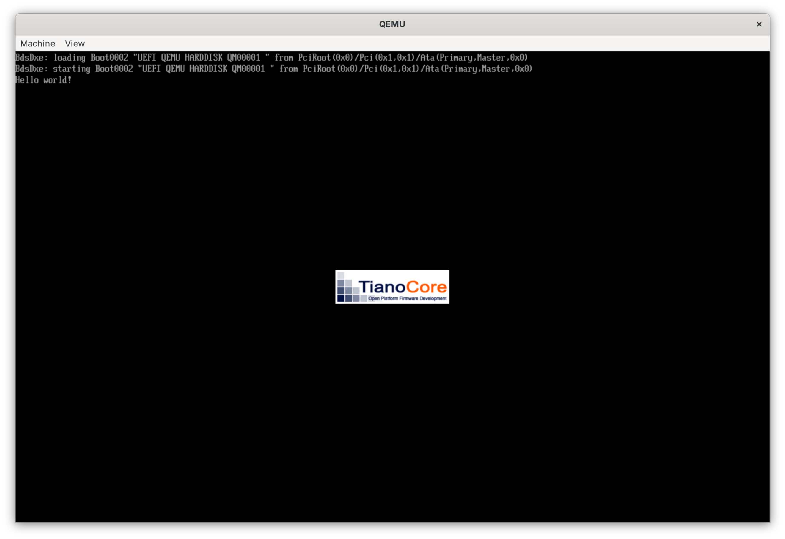
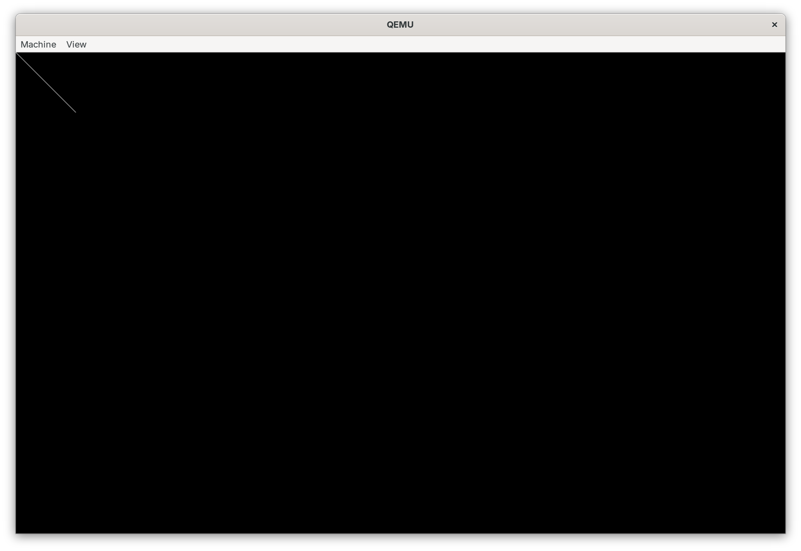
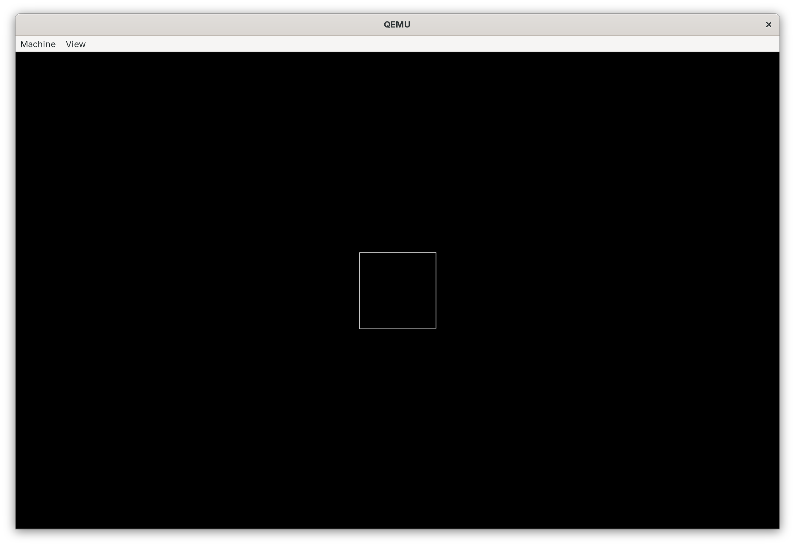

# Minimal bootloader in Rust
> Creating minimalistic UEFI bootloader in rust targeting x86_64

## Table of content
1. [About the guide](#about-the-guide)
2. [Intorduction](#introduction)
    1. [Boot Sequence](#boot-sequence)
    2. [The task of the bootloader](#the-task-of-the-bootloader)
3. [Briefly into UEFI](#briefly-into-uefi)
4. [Hello world!](#hello-world)
    1. [`no_std` and the `core` library](#no_std-and-the-core-library)
    2. [The `uefi` crate](#the-uefi-crate)
    3. [Hello world program](#hello-world-program)
5. [Running in an emulator](#running-in-an-emulator)
    1. [Compilation](#compilation)
    2. [Creating UEFI system partition](#creating-uefi-system-partition)
    3. [Emulator and OVMF](#emulator-and-ovmf)
5. [Example kernel in assembly](#example-kernel-in-assembly)
    1. [Assembly routine](#assembly-routine)
    2. [Linking](#linking)
    3. [Compilation](#compilation-1)
6. [Loading the kernel](#loading-the-kernel)
    1. [Protocols and handles](#protocols-and-handles)
    2. [Loading the kernel](#loading-the-kernel-1)
        1. [Opening the root directory](#opening-the-root-directory)
        2. [Path to the kernel](#path-to-the-kernel)
        3. [Obtaining information about the file](#obtaining-information-about-the-file)
        4. [Reading the file](#reading-the-file)
7. [Paging and the x86_64 crate](#paging-and-the-x86_64-crate)
    1. [Memory protection in general](#memory-protection-in-general)
    2. [Paging - briefly](#paging---briefly)
        1. [Paging in general](#paging-in-general)
        2. [Math, tables and entries](#math-tables-and-entries)
        3. [Paging is like onion](#paging-is-like-onion)
        4. [Virtual addresses](#virtual-addresses)
        5. [Caching](#caching)
        6. [Identity mapping](#identity-mapping)
    3. [`x86_64` crate](#x86_64-crate)
8. [Parsing the ELF using goblin](#parsing-the-elf-using-goblin)
    1. [Elf file](#elf-file)
    2. [Mapper and frame allocator](#mapper-and-frame-allocator)
    3. [Write protection](#write-protection)
    4. [Mapping the kernel](#mapping-the-kernel)
9. [Gathering boot info](#gathering-boot-info)
    1. [UEFI GOP](#uefi-gop)
    2. [MMIO and framebuffer](#mmio-and-framebuffer)
    3. [Obtaining the framebuffer](#obtaining-the-framebuffer)
    4. [CPU rendering demonstration](#cpu-rendering-demonstration)
    5. [Packing it up](#packing-it-up)
10. [Switching to kernel](#switching-to-kernel)
    1. [Stack](#stack)
    2. [Goodbye boot services](#goodbye-boot-services)
    3. [The assmebly routine](#the-assmebly-routine)
    4. [Does it work?](#does-it-work)
11. [Simple kernel in C](#simple-kernel-in-c)

---

## About the guide

This text is not a complete manual, but rather a guide describing the development of a very simple bootloader for the x86_64 architecture. It covers most of what a bootloader needs to do to start the kernel.

To be precise, the bootloader itself will be written in the Rust programming language using the `uefi` library. The demo kernel is written in C, but to simplify the early stages of development, an Assembly language kernel will be used.

My [github repository](https://github.com/LittleHobbitFrodo/OxyBootloader) contains source code for this guide (altogether with the `util` script to build the bootloader).

## Introduction

If you are reading this article, you are probably interested in bootloader development, but you cannot develop a bootloader without knowing something about why it exists and what it does.

So let's start with a quick introduction.

### Boot sequence
> What happens when you press the start button on your computer?

When you press the Start button, your computer will probably spin up its fans, then display the manufacturer's logo, and here is your operating system. Pretty straightforward, right? Well, not so much...

The Start button causes electricity to magically flow into the processor, which launches the firmware. The firmware is software stored in ROM (**R**ead-**O**nly **M**emory) on the motherboard. As you may have already figured out, firmware is the first piece of code that runs on your computer, but what does that actually mean? The firmware must initialize all components in your computer, including the keyboard, mouse, displays, and everything else, in order to run our bootloader.

In fact, the firmware must also initialize the CPU. The reason for this is that, for backward compatibility with older software, it first runs in 16-bit mode. This means that, theoretically, you could run MS-DOS on your computer!

After completing the initialization process, the firmware searches for our bootloader. If it finds it, it hands control over to it.
- Modern UEFI systems use the EFI system partition, where the firmware attempts to locate the bootloader
- Older BIOS systems (the predecessor to UEFI) used MBR, where the bootloader itself was stored in the first 512 bytes of the disk. Bootloaders at that time were relatively primitive and mostly written in assembler.


### The task of the bootloader

Our bootloader has a seemingly simple task:

1. Find and load the kernel executable file.
2. Analyze the executable file and map its virtual address space.
3. Collect the data that the kernel needs.
4. Transfer control to the kernel and jump into it.


## Briefly into UEFI

> What is UEFI? How do we interact with it?

UEFI stands for **U**nified **E**xtensible **F**irmware **I**nterface. It's not just a magical thing that initializes your computer and loads the boot loader. It also provides services. Specifically, UEFI **Boot** and **Runtime** services. What's the difference between them?

UEFI **Boot** services are there to help your bootloader. They consist of interfaces for working with memory, loading and saving data from disks, etc. ~~In short, it gives your bootloader the superpowers it needs.~~

**Runtime** services, on the other hand, help the operating system itself perform some fairly specific tasks. For example, shutting down or restarting the computer.

For this project, we will be using the `uefi` crate to handle the firmware communication. It provides fairly simple safe abstractions for interaction with the boot and/or runtime services.

Let's focus on something practical for a change!


## Hello world!

In order to create the bootloader executable, we need to talk about rust and its `no_std` executables.

### `no_std` and the `core` library
Most rust programs require and operating system to be able to work. But bootloaders are made to bring the operating system to life. So how can we make rust work with no operating system? Fortunately, Rust developers built it in with the `no_std` attribute.

`#![no_std]` is crate level attribute that tells the compiler that the crate is supposed to be linked with the `core` library instead of `std`. Core is smaller than std but its providing only very basic functionalities and types. It is also not dependent on any platform and/or operating system, so it can work with no OS at all.


### The `uefi` crate

We cannot make an bootloader only with the `core` library. Luckily we can use the [uefi](https://crates.io/crates/uefi) create.

Uefi provides all the features you need to work with UEFI firmware in a secure and convenient way. It also provides some primitive features from the standard library. For example, `Box`, `Vec` or the `print!()` macro.

In order for our program to work with the library, we need to use the `#![no_std]` attribute together with `#![no_main]`. The `no_main` attribute tells Rust not to expect the main function, because we cannot use it with the uefi crate. Instead, we have the procedural macro `#[entry]`

The reason why UEFI does not support Rust's typical main function is that the firmware expects you to return a status indicating success or failure and its cause. UEFI provides the `Status` structure for this purpose.

### Hello world program

```rust
#![no_main]
#![no_std]

use uefi::{self, entry, Status, print, println};

#[entry]
fn main() -> Status {

    uefi::helpers::init()
        .expect("failed to initialize helpers");
        //  optional: initializes features such as allocator

    println!("Hello world!");

    uefi::boot::stall(10_000_000);

    Status::SUCCESS
}
```

In the code above, the `uefi::boot::stall()` function causes the program to take a break for 10 seconds and then continue execution. That is to prevent immediate reboot.

## Running in an emulator

> You can take a look at the [`util` script](./util), which contains all the logic for creating the ISO image and running the emulator.

### Compilation

Compilation of the bootloader is quite simple. Since we can use `cargo`, a single command is all it takes. However, because we are not compiling for a native target (OS and architecture) and/or operating system, we need to tell `cargo` what target to compile for. That means we need to use the `--target` switch following with the uefi target which is `x86_64-unknown-uefi`.

So `cargo build --target x86_64-unknown-uefi` and we are done.

### Creating UEFI system partition

The bootloader is stored in UEFI system partition. It is (usually) small FAT-32 partition that stores the bootloader and its files together with the OS kernel that will be loaded. Luckily, you do not have to create an image of the partition, just its file structure. So lets begin.

For simplicity, the bootloader itself must be located in the `/EFI/BOOT/` directory and must be named `BOOTX64.EFI` (on x86_64 systems). The compiled bootloader is usually put into `target/x86_64-unknown-uefi/debug-or-release` (from project root directory). Other components, such as configuration or kernel, can be located anywhere in the partition, as the bootloader loads them manually. The kernel in the example project is located in `/oxy/kernel.elf`.

Once you have the UEFI system partition structure ready, you can run the bootloader in emulator.

### Emulator and OVMF

Since testing the bootloader on a real computer is very slow and inconvenient in almost every way, I will explain how to use an emulator. Qemu (**Q**uick **EMU**lator) supports a large number of platforms and is widely used to test operating systems and/or bootloaders.

Most emulators (including Qemu) can emulate only legacy BIOS by default. However, we can use [OVMF](https://github.com/tianocore/tianocore.github.io/wiki/OVMF) (**O**pen **V**irtual **M**achine **F**irmware), which is an open source implementation of UEFI for Qemu. You need to install it and then point Qemu to where it is located.

First we need to tell Qemu where to find the UEFI system partition and how to treat it as disk. This is what the `-drive` switch is for. Typical boot drive configuration can look like this: `-drive format=raw,file=fat:rw:efi-img/`. But what does it do?

- `format=raw` makes the drive exposed as raw bytes-to-bytes hard drive.
- `file=fat:rw:path/to/UEFI-syspart/` use the drive/partition as FAT-32 formatted.
  - `rw` allow reading and writing, just `r` will do for our usecase.
  - `path/to/UEFI-syspart/` path to the [UEFI system partition structure](#creating-uefi-system-partition).


Now we need to tell Qemu where to find the firmware. We can use the `-bios` switch: `-bios path/to/OVMF_CODE.fd`.

With these two switches, the resulting command looks like this: `qemu-system-x86_64 -drive format=raw,file=fat:rw:efi-img/ -bios path/to//OVMF_CODE.fd`.

After running, a window will appear:



## Example kernel in assembly

In order to work on the bootloader, we need something to load. In this chapter, we will create a primitive kernel — a few lines of assembly.

### Assembly routine

The whole "kernel" can be described in this code:
```
extern _start

_start:
cli
loop:
hlt
jmp loop
```

The whole code does exactly this:
1. `extern _start`: Creates `_start` symbol reference and leaves its resolution to the linker.
    - Makes it visible to our bootloader.
2. `cli` (**CL**ear **I**nterrupt): This instruction disables interrupts by flipping a bit in one of the control registers.
    - You can find more on the [OSDev Wiki](https://wiki.osdev.org/Interrupts)
3. `hlt`: Disables execution of code until interrupt occur
    - Interrupts are disabled, so the execution shall not continue from here.
4. `jmp loop`: Just a safeguard to prevent uninitialized memory from being executed by creating infinite loop.


### Linking

In order to compile the kernel, we must first create an object file and then link it. An object file is a partially compiled program. It contains part of the machine code and references to other functions/symbols, which are resolved by the linker.

To link the files together, we need a special linker script. The linker script does not contain any logic; it is more like a map that tells the linker where each section of memory is located in the final executable file.

Since the kernel does not use any data, our linker script can be very simple:
```ld
ENTRY(_start)

SECTIONS
{
    . = 0xFFFFFFFF80000000;
    .text : { *(.text*) }
}
```

Before I explain what the linking script actually does, I should tell you something about sections. In a nutshell, of course!

Sections are essentially parts of your program. Each section can store data or executable code and has its own set of permissions that are enforced by the processor. Typical sections are:
- `.text`: Stores the executable code.
- `.data`: Stores variables and statically allocated memory.
- `.rodata`: Read-only data, constants.

Now back to the linker script: what does the script actually do?
- `ENTRY(_start)` sets the `_start` function as the program's entry point.
- `. = 0xFFFFFFFF80000000;`: This tells the linker to place the start of the executable at virtual address `0xFFFFFFFF80000000`. This is important, because most kernels use the higher half of the virtual address space.
  - For more information, see the [OSDev wiki](https://wiki.osdev.org/Higher_Half_x86_Bare_Bones).
- `.text : { *(.text*) }`: This tells the compiler that the `.text` section (executable code) should be placed as the first section. Thus on address `0xFFFFFFFF80000000`.

### Compilation

To compile the kernel, we need the `nasm` assembler and any linker capable of linking freestanding binary for the x86_64 architecture. Pesonally, I prefer the `x86_64-linux-gnu-ld`, although better options may be available.

1. Create Object file by running `nasm -f elf64 kernel.asm -o kernel.o`
2. Link it with the linker script: `x86_64-linux-gnu-ld -o kernel.elf kernel.o -T linker.ld`
    - Do not forget to use your linker script with the `-T` switch!

## Loading the kernel

Reading files is not an easy process when you don't have any OS to support you. But perhaps it's not that difficult when you have UEFI instead of a regular operating system...

### Protocols and handles

Almost every action done using UEFI needs some protocols. Let's take a look at them!

UEFI provides access to a set of protocols and their handles. Handles usually represent some kind of resource, whether it be a disk, screen, or something else. Each handle serves as a gateway to an associated protocol.

On the other hand, protocols are raw interfaces to associated resources, usually consisting of a list of functions that are called.

The uefi crate wraps all these handles as structures, ensuring Rust's safety guarantees and keeping you safe from low-level issues.

### Loading the kernel

#### Opening the root directory

To load the kernel (or any other file), we need to get the `SimpleFileSystem` protocol and open its root directory, where we can then locate the file.

The `SimpleFileSystem` protocol is opened by calling the `uefi::boot::get_image_file_system()` function, which we pass the UEFI system partition descriptor to by calling the `uefi::boot::image_handle()` function.

Once we have obtained the SFS protocol, we can open its root directory. We do this by calling the `open_volume()` function on the `SimpleFileSystem` protocol we obtained in the previous step.

The simplified final code looks like this:
```rust
let mut sfs = uefi::boot::get_image_file_system(uefi::boot::image_handle())
    .expect("failed to open SFS");
 let root_dir = sfs.open_volume().expect("failed to open root dir");
```

#### Path to the kernel

UEFI is a standard made for advanced C programs. Therefore all/most paths are UTF16 encoded and null terminated. Wouldn't want to do this stuff in C, would you..

Fortunately, we are rustaceans and we have a convenient way to do this: introducing `CStr16`, UTF16 encoded, null terminated string.

The conversion is simple: First we need to allocate buffer, gool old array on the stack will do. Then we call the `CStr16::from_str_with_buf()` function, which does the conversion.

> **Note**: all paths are also separated by backslash (like on windows).

```rust
let mut name_buf = [0u16; 256];
let filename = CStr16::from_str_with_buf("\\oxy\\kernel.elf", &mut name_buf)
    .expect("failed to convert to UTF16");
```

#### Obtaining information about the file

The next step is to find out how long the file is. We also need to check wheether the file is actually a regular file or directory. To do this, we need to obtain handle to the file.

We can obtain `FileHandle` by calling the `open()` function on the root directory structure. This function takes the following parameters:
1. `&Cstr16`: Converted file name.
2. `FileMode`: Choose between reading and/or writing.
3. `FileAttributes`: Special functions, such as read-only files or backup files, we want the attributes to be empty.

To check the file type, we simply call the `into_regular_file()` function, which consumes the handle. The function returns `Some()` if the file is a regular file, and `None` if it is a directory.

```rust
let handle = root_dir.open(filename, FileMode::Read, FileAttribute::empty())
    .expect("failed to open the kernel");
let file = handle.into_regular_file().expect("found directory");
```

Once we have the file opened, we can finally measure the length of the file. In bytes of course. But since we are working with uefi, its not as simple as it could be. We have to get the `FileInfo` structure into preallocated buffer.

As I said, we need to preallocate a buffer in advance (and again) array on the stack will do. Then we need to call `get_info()` function on the regular file handle and pass reference to the buffer.
> **Note**: The `get_info()` function requires explixit type annotation (`&FileInfo`).

```rust
let mut info_buf = [0u8; 512];
let info: &FileInfo = file.get_info(&mut info_buf)
    .expect("failed to get file info");
```

Now we can finally find out the length of the file using the `file_size()` function from the returned `FileInfo` structure.

```rust
let file_size = info.file_size() as usize;
```

#### Reading the file

Before we can continue analyzing the file, we need to load it into one location and then copy some of its data to a predetermined location. Well, now we have other things to worry about...

When reading a file, we need to allocate buffer in advance. And since we don't know the length of the file at compile time, we can't use the good old stack allocated buffer. However, we can use the `allocator-api2` crate, which is also used by the standard library. `allocator-api2` provides all the useful things, such as `Vec` or `Box`.

The function used to read the file is, as expected, `file.read()`. It takes a mutable reference to the buffer and returns a `Result` indicating whether it failed.

```rust
let mut loaded: Box<[u8]> = unsafe { Box::new_zeroed_slice(file_size)
    .assume_init() };

file.read(&mut loaded).expect("failed to load the kernel");
```


## Paging and the `x86_64` crate

### Memory protection in general

Some computers, such as controllers or other single-processor computers have two types of memory. RAM and ROM. ROM (short for **R**ead **O**nly **M**emory) contains all executalbe code. On the other hand, RAM (**R**andom **A**ccess **M**eory) stores the stack and heap (mutable memory in general).

But when advanced computers came along, operating systems commonly loaded more programs into RAM at the same time. The problem was that all the programs a single one memory. One shared memory for all executable code, stacks, heaps and the operating system itself. You guessed it, this caused certain problems...

At this time, the first attempts to create a certain level of memory protection appeared. The first memory protection mechanism in x86 was implemented on 16-bit processors. It is called segmentation.

[Segmentation](https://wiki.osdev.org/Segmentation) is not that complicated: you have a list of segment descriptors that is used to divide existing memory into segments, each with its own permissions. X86 processors also has a set of segment registers. These registers are used by the operating system to set which memory a currently running program can use and how.

When first 32-bit processors we introduced, this mechanism was simply extended to 32-bit address space and descriptors with backwards compatibility in mind.

The problem with segmentation is that it is very difficult to manage effectively. It's a common vector problem: it's effective for push and pop, but not so much for inserting or removing.

Paging solves this problem!

And adds a lot of complexity and abstraction to it...

### Paging - briefly

> This chapter contains only the most important information, visit [OSDev wiki](https://wiki.osdev.org/Paging) to read more.

Have you ever looked at your pointers and said to yourself, "Wait a minute, I don't have that much memory"?

No? Nevermind...

#### Paging in general

Compared to segmentation, paging is a pretty abstract and complicated concept. Don't worry if you don't get it right away. It took me about a month to understand it, and mistakes are still on my daily menu.

Address types:
- **Virtual** addresses are converted to physical addresses by the CPU. They are used to strictly limit what memory each program can use and how it can use it. Regular computers are using 48 bits of the virtual address.
- **Physical** addresses are pointing to the real location in the physical memory.

#### Math, tables and entries

To do a deep dive into the concept of paging, we must first to introduce a few terms:
- A **page table** is an **array of 512 page entries**. It occupies exactly 4KB of memory and its address is always aligned to 4KB. Why these numbers? Those numbers are quite important...
- A **page Entry** is a 64-bit binary structure that stores 36 bits of memory address. The remaining 28 bits are treated as flags or are unused.

Lets take a look at the numbers. Each page entry is 64 bits, or 8 bytes. Each page table stores 512 entries. How much is `8 * 512`? Exactly `4096`, or 4KB. Now we see that each page table is 4KB in size.

Remember how I told you that only 48 bits of a virtual address are used? And how I told you that each page entry contains 36 bits of the physical address? Yes, correct. I lied.

Since converting 48 bit virtual addresses to 36 bit physical addresses makes no sense, page entries use one simple trick: they actually contain only 36 bits of the address, but are interpreted as 48 bits. How? When you look at the table entry [structure](https://wiki.osdev.org/images/thumb/4/41/64-bit_page_tables1.png/450px-64-bit_page_tables1.png), you can see that the first 12 bits are flags. How much is `36 + 12`? Yes, `48`. See how it fits together? Those 36 bits of the physical address stored in the entry are only the upper 36 bits. The other (lower) 12 bits are not present in the entry and are treated as cleared.

These 12 unused/cleared bits ensure that each address referenced by a table entry is aligned to 2 to the power of 12. Which is `4096`, or 4KB. And now you know why the page tables are aligned too!

#### Paging is like onion

Paging consists of a four-level tree structure that the CPU traverses. The path through the graph is the actual virtual address, which contains indexes for each level.

Levels:
1. **PML4** - **P**age **M**ap **L**evel **4**, **PS** page size: 512 GB.
2. **PDPT** - **P**age **D**irectory **P**ointer **T**able, **PS** page size: 1 GB.
3. **PD** - **P**age **D**irectory, **PS** page size: 2 MB.
4. **PT** - **P**age **T**able entry, **PS** is unsupported at this level.
> The list is reversed, PML4 is generally considered to be the fourth level.

The CPU begins the traversal by looking at the address in the `cr3` control register. This is the physical address of the **PML4** table. It then obtains the PML4 index from the virtual address to read an entry at that position.

The CPU then continues by reading the flags of the entry: if the **P**resent flag is cleared, a page fault is triggered, which is caught by the operating system. Otherwise, it continues by checking the **P**age **S**ize flag. If it is set, the pml4 entry is considered a pointer to a 512 GB page. Otherwise, the entry is considered a pointer to a third-level table.

The CPU then obtains the index for the next level and reads entry at the position. Checks the **P**resent and **P**age **S**ize flags. If **PS** is set, the entry is considered a pointer to 1GB (or 2MB at the PD level) page. Otherwise the CPU goes to the next level. This cycle continues to the first level, where all entries always point to a 4 KB page, or until it finds entry with the **PS** flag set.

When the page address is found, the CPU simply adds the offset from the virtual address to it.

#### Virtual addresses

Paging works on the concept of translating virtual addresses to physical addresses in the MMU (**M**emory **M**anagement **U**nit) within the CPU. Each virtual address is a binary structure that allows the MMU to navigate within a **4 level tree structure** to translate the virtual address to a physical address. Mind blowing, right?

Each virtual address is 64-bit binary structure. Lets see what's inside:
- **Offset** is the lowest 12 bits, representing the offset from the 4KB aligned memory region referenced by the last page table.
- **PT index**: Next 9 bits are used to navigate the fourth page table (in the PT level). As you can see that 9 bits can hold maximum value of 511.
- **PD index**: Next 9 bits used to navigate the third page table (in the PD level).
- **PDPT index**: Another 9 bits. Used to navigate the second page table (in the PDPT level).
- **PML4 index**: The last 9 bits. Used to navigate the first page table (in the PML4 level).
- **Sign**: The remaining 16 bits. All bits must be set to 0 for user processes or to 1 for the OS kernel.

You can visualize it like this (MSB on the left):
| 64 - 48 | 47 - 39 | 38 - 30 | 29 - 21 | 20 - 12 | 11 - 0 |
|------|------|------|----|----|--------|
| Sign | PML4 | PDPT | PD | PT | Offset |
| 16b | 9b | 9b | 9b | 9b | 12b |

### Caching

To make the conversion of virtual addresses to physical addresses faster, the CPU contains a cache that speeds up the conversion.

The whole cache can be flushed by simply writing into the `cr3` register. On the other hand the `INVLPG` (invalidate tlb entry) instruction invalidates/removes only one address. This is important when you remove valid addresses from the address space to prevent some problems.


#### Identity mapping

UEFI runs the bootloader in what is known as an [identity-mapped](https://wiki.osdev.org/Identity_Paging) virtual address space. Identity mapping means that each virtual address directly corresponds to its physical address. Simply put, virtual address `0xBEEF` would refer to physical address `0xBEEF`.

### `x86_64` crate

Although x86_64 paging makes sense and is well designed, it can be quite a challenge. Fortunately (for us), the Rust OSdev team maintains the [`x86_64`](https://crates.io/crates/x86_64) crate. It provides safe abstractions over some x86_64-specific instructions and (most importantly) virtual address space mappers. These are the things that do paging for us.

We will use the `Cr0::update()` function to disable memory protection. And for paging, we will use the `OffsetPageTable` mapper together with our own frame allocator.

## Parsing the ELF using goblin
> This logic is split into `kernel::prepare()` and `kernel::map_kernel_section()` functions in the example project.

[`goblin`](https://crates.io/crates/goblin)  lets you analyze different executable file formats in just a "few" lines of code. For this guide, we'll only use the ELF format.

Since UEFI does not offer any functionality for working with custom virtual addresses, we have to do the paging ourselves... Or we can leave it to the `x86_64` crate!

### Elf file

Once you load the ELF executable file (our kernel), you can let `goblin` do the dirty work for you and analyze the file.

For this we can use the `Elf::parse()` function which returns an `Result` containing the parsed `Elf`. It takes reference to the loaded file as slice of bytes.

The usage is as simple as this:
```rust

//  let loaded:  Box<[u8]> = load_kernel() ...

use goblin::elf::Elf;

let elf = match Elf::parse(loaded.as_ref()) {
    Ok(elf) => elf,
    Err(e) => {
        //  ...
    },
};
```

Since `goblin` does most of the work for us, we can take a look directly at the program headers. Each program header describes a segment of the program. It tells us what to load, were to load it and how to load it. All loadable segments are labeled with `PT_LOAD`.

We can simplify this by creating an iterator that filters out all headers we do not need:
```rust
let mut iter = elf.program_headers.iter();
for header in  iter.filter(|head| head.p_type == program_header::PT_LOAD ) {
    //  parse the header
}
```

Each header contains these properties:
- `p_vaddr`: This is the starting virtual address of the loaded segment.
- `p_memsz`: Amount of bytes to allocate for the segment.
- `p_filesz`: Amount of bytes to copy from the file.
- `p_offset`: Starting location (offset) from the start of the file
  - Copy exactly `p_filesz` bytes from here.

Permissions for each segment can be determined by calling `header.is_executable()` and `header.is_write()`.


### Mapper and frame allocator

The `OffsetPageTable` mapper works with its frame allocator and an offset. We are in identity-mapped environment, so the offset is naturally zero.

First, we need to create a frame allocator. Don't worry, we don't have to create the allocator from scratch. We can use the fantastic `uefi::boot::allocate_pages()` function. **Warning**: this function (even though its name suggests otherwise) actually allocates physical frames instead of virtual pages. The difference is that classic virtual page allocation covers the physical address with virtual address space. In contrast, frame allocation only marks a piece of physical memory as used (without covering it).

First, we need to create an empty structure. Then we need to implement the `FrameAllocator` trait for it. This trait consists of one function that we need to implement: `fn allocate_frame()`, which in this case serves as a harness for the `allocate_pages()` function:
```rust
use x86_64::structures::paging::{FrameAllocator, Size4KiB, PhysFrame};
use uefi::boot::allocate_pages;

struct FrameAlloc;

unsafe impl FrameAllocator<Size4KiB> for FrameAlloc {
    fn allocate_frame(&mut self) -> Option<PhysFrame<Size4KiB>> {
        //  allocate physical frame
        let frame = allocate_pages(AllocateType::AnyPages, MemoryType::LOADER_DATA, 1).ok()?;

        //  convert to PhysAddr
        let phys = PhysAddr::new((frame.as_ptr() as usize) as u64);

        //  PhysAddr to PhysFrame
        Some(PhysFrame::containing_address(phys))
    }
}
```

Now we can create a mapper using the `OffsetPageTable::new()` function, which takes reference to the PML4 table and an offset. How do we get the reference to the PML4 table? We use a little inline assembly to read the `cr3` control register. Since the four least significant bits of the register are considered flags, we need to clear them.
```rust
use core::arch::asm;

let pml4: &'static mut PageTable = unsafe {
    let mut cr3: u64;

    //  load the cr3 into the variable
    asm!("mov {}, cr3", out(reg) cr3);

    //  clear first 12 bits
    cr3 &= !0xfff;

    //  convert to static mutable reference
    NonNUll::new_unchecked((cr3 as usize) as *mut PageTable).as_mut();
};

//  create mapper with offset equal to 0
let mut mapper = unsafe { OffsetPageTable::new(pml4, VirtAddr::new(0)); };
```

### Write protection

Now try mapping an address. Did it freeze? You may be surprised, but freezing is expected behavior. Since the PML4 table is located in a write-protected memory region, we cannot write to it.

How to get around this?

We have to modify the `cr0` register ro remove the `WRITE_PROTECT` flag with `Cr0::update()` function:
```rust
Cr0::update(|flags| flags.remove(Cr0Flags::WRITE_PROTECT) );
```

> If the IDE/text editor is screaming errors, try to compile it... The function is enabled only for baremetal targets, so rust-analyzer thinks it does not exits.

After completing the mapping routine, we need to re-enable the protection for... well, kernel memory protection. You can do this using the same routine, but with the `flags.insert()` function instead of `remove()`.


### Mapping the kernel

> Note: For simplicity, we map the kernel's virtual address space to the space belonging to the boot loader.

Our kernel is now just one executable page. In fact, it's only a few bytes, so I won't go into details here.

To map each section of the kernel, we need to prepare few things:
- Virtual address of the section.
- Physical frame for each section.
- `PageTableFlags`: permissions for the section.

Then we can use the `mapper.map_to_with_table_flags()` function to cover the physical region in virtual address space. The next step is to allocate the physical region and copy the executable data into correct location:

```rust
let mut virt = VirtAddr::new(header.p_vaddr);

let mut phys = allocate_pages(AllocateType::AnyPages, MemoryType::LOADER_DATA, page_count) /*as u64*/;
let mut frame: PhysFrame<Size4KiB> = PhysFrame::containing_address(PhysAddr::new(phys));

let flags = /*resolve PageTableFlags*/;
//  parent tables must always be writeable
let parent_flags = PageTableFlags::WRITABLE | PageTableFlags::PRESENT;

unsafe {

    //  map addresses
    match mapper.map_to_with_table_flags(Page::containing_address(virt), frame, flags, parnet_flags, frame_alloc) {
        Ok(flush) => flush.ignore(),
        Err(_) => {
            //  treat errors
        }
    }

    //  copy data
    let region = NonNull::new_unchecked(phys as *const u8);
    let file_ptr = NonNull::new_unchecked(loaded.as_ptr());
    let offset = header.p_offset as usize;
    let copy_size = header.p_filesz as usize;

    region.copy_from_nonoverlapping(file_ptr.add(offset), copy_size);

}
```

The provided code works only when mapping one page per section.

> Do not forget to re-enable the memory protection!

## Gathering boot info

> This guide only includes a practical example of how to find information about the framebuffer, i.e., the graphics output.

As you may have suspected, the kernel of the operating system needs certain information to boot. This information may include the layout of physical and/or virtual memory, graphics output, etc.

We will only focus on graphics output.

### UEFI GOP

UEFI exposes so-called UEFI [GOP](https://wiki.osdev.org/GOP) (**G**raphics **O**utput **P**rotocol) protocol. What it does is quite self explaining...

GOP is used to render graphics by bootloaders, OS installers and other utilities like OS recovery. Unfortunatrly what GOP does provide is GPU acceleration. After all its only a temporary solution to graphics rendering.

### MMIO and framebuffer

The GOP protocol consists mainly of a framebuffer and its metadata. What is a framebuffer? Simply put, it is an array of pixels. But how can an array of pixels control what is displayed on the screen? This is because the framebuffer is in MMIO-mapped memory.

MMIO (**M**emory **M**apped **I**nput and **O**utput) is basically fake memory. Fake in the sense that it is not memory, but rather an abstraction of an IO interface. Let me explain: when you want to send or receive some information from any device (such as keyboard, timer, etc.) you use the `outd`/`ind` (or alternative) instructions. These instructions tells the device that it should either send or receive data. But since MMIO disguises itself as memory, the memory read/write request is sent to the MMU, where the MMU decides whether to send it to memory or to some other device. In this case, perhaps the display.

So when you write to the framebuffer, it is not stored in memory but sent to the display.

### Obtaining the framebuffer

To obtain the framebuffer, we first need to get the handle to it and the open the protocol. The last time we were opening an protocol, it was quite simple> just the `boot::get_image_file_system()` function and we were done. This time we are not so lucky.

We need to open the protocol with the `boot::open_protocol()` function which requires us to construct the `OpenProtocolParams` structure that is the passed to the function. We can create it by passing in the GOP protocol handle, our image handle and an controller, which is only used for UEFI drivers and therefore set to `None`.
```rust
let handle = match get_handle_for_protocol::<GraphicsOutput>()
    .expect("failed to obtain GOP handle");

let params = boot::OpenProtocolParams {
    handle, agent: boot::image_handle(), controller: None
};

let mut gop: ScopedProtocol<GraphicsOutput> = match unsafe {
    open_protocol(gop_params, OpenProtocolAttributes::GetProtocol)
}.expect("failed to obtain GOP");
```

Now we can use the protocol to access the framebuffer metadata:
- `gop.resolution()` returns a tuple representing the framebuffer dimensions in pixels: `(width, height)`.
- `gop.pixel_format()` provides us with a `PixelFormat` enumeration that tells us the framebuffer format. Usually `Rgb`.
  - Since we are running the bootloader in Qemu, we can assume that the format is `Rgb` (4 bytes per pixel).
- `gop.frame_buffer()` returns a pointer to the actual framebuffer MMIO-mapped data.

### CPU rendering demonstration

To demonstrate how does the framebuffer work I will show you how to clear the display and the draw a line.

Once you have access to the framebuffer metadata, you can treat its data as an slice:
```rust
//  assuming rgb format
let ptr = gop.frame_buffer().as_mut_ptr() as u32;
let size = gop.resolution().0 * gop.resolution().1;

//  represnt the framebuffer data as slice
let data: &mut [u32] = unsafe {
    core::ptr::slice_from_raw_parts_mut(ptr, size).as_mut().unwrap()
};
```

Clearing the framebuffer is simple: just iterate through the pixels and set them all to 0, which represents black in RGB. As for the line, it's not complicated either. Since a horizontal line starting in the upper right corner would be easy to overlook, we'll draw it across. To do this, simply index the array by the horizontal index plus the vertical index multiplied by the width of the framebuffer.
```rust
//  clear the screen
for pixel in data.iter_mut() {
    *pixel = 0; //  clear the pixel
}

//  draw the line (100 pixels in length)
for i in 0..100 {
    //  0xFFFFFF represents white
    data[i + (i * gop.resolution().0)] = 0xFFFFFF;
}
```

The output on the screen will look like this:


### Packing it up

Most real boot loaders use a request-response approach to deliver information to operating systems. The operating system essentially creates a static request structure, which the bootloader detects and fills with data. You can check out the [Limine protocol specification](https://codeberg.org/Limine/limine-protocol/src/branch/trunk/PROTOCOL.md), Limine's own bootloader protocol. If you want to create your first operating system kernel, I highly recommend trying limine for its simplicity and the limine-rs Rust wrapper.

We will choose the simple method, where the bootloader collects all the information the kernel may need and packs it into a structure. The kernel then receives the data in the form of a pointer to the structure, which is passed to it as a parameter.

There is one more thing you will need: Rust can rearrange the individual members of your structures as it pleases (apparently for optimization purposes). However, since the operating system kernel does not know what order they will be in, we need to prevent this. This is done using the `#[repr(C)]` attribute, which tells the compiler that the structure must be compatible with C and therefore cannot be changed.

For this purpose I created the `BootInfo` structure in the [`kernel/boot-info.rs`](src/kernel/boot_info.rs) file.

## Switching to kernel

Although switching to the kernel is not difficult, debugging it can be quite frustrating. You have to nail many things just right. Mainly kernel virtual address space mapping, elf file parsing, etc.

And as usual, the emulator leaves only cryptic messages about what happened.

All you need to do is prepare the kernel stack and the pointer to the boot information. Then exit the boot services and run a small piece of assembly code.

### Stack

> The stack allocation routine is loacted in the [`BootInfo::collect()`](src/kernel/boot_info.rs) function in the example project.

We could teoretically use the bootloader stack, but that wouln't be much fun...

It's not complicated. Just allocate enough pages, so one call to `allocate_pages()` is enough. That's (almost) it. But since x86_64 only supports a descending stack, we need to calculate the stack top. This is the pointer we pass to the kernel.

```rust
//  allocate 32KB of stack memory
let stack_bottom = boot::allocate_pages(AllocateType::AnyPages, MemoryType::LOADER_DATA, 8)
    .expect("failed to allocate stack");

//  passed to the kernel
let stack_top = unsafe {
    stack_top.add(8 * 4096)
};
```

### Goodbye boot services

It seems we have reached the point where we no longer need boot services. By exitting UEFI boot services, we will unlock runtime services.

This is done using the `exit_boot_services()` function. It wants to know where to place the current memory map. Since we have no specific requirements, we will leave the first parameter set to `None` to use the defaults.

### The assmebly routine

The assembly routine itself is simple too. This is all we want from it:
1. Set the first function parameter to the boot information pointer.
2. Use the allocated stack.
3. Jump to the kernel entrypoint.

In the example project, this process is somewhat complicated, so I will explain it. The `kernel::switch_to_kernel()` function accepts `MetaData` and `BootInfo` structures. Inside, the boot information is moved to `Box`, which is leaked and therefore will not be dropped. It contains a stack pointer and a framebuffer. On the other hand, in the `MetaData` structure, we are interested in the kernel entry point.

But how do we pass the pointer to the boot information? According to C calling conventions, we simply write the pointer to the `rdi` register, which is considered the first parameter.

As for the stack, we must write the pointer to the top of the stack to the `rsp` register and reset the `rbp` register. 

```rust
unsafe {
    asm!(
        "cli                        #   turn off interrupts (just in case)
        mov rdi, {boot_info_ptr}    #   initialize the first param
        mov rsp, {stack_top}        #   use the new stack
        xor rbp, rbp                #   clear previous (bootloader) stack frame pointer
        jmp {kernel_entry}          #   jump to the entry point",
        kernel_entry = in(reg) kernel_entry,
        boot_info_ptr = in(reg) boot_info_ptr,
        stack_top = in(reg) stack_top
    );
}
```

### Does it work?

Thats hard to tell...

Since our simplified kernel is designed to stop the CPU, we can only look at the logs. If you find a line starting with `check_exception old:<hexadecimal number> new <hexadecimal number>`, it means that an error has occurred. You can then search for the error on the [OSDev wiki](https://wiki.osdev.org/Exceptions) and analyze it. The error code is recorded as the second hexadecimal number, i.e., after the word `new`. Look for the column titled "Vector nr. ".

## Simple kernel in C

If your kernel switch works, why stop the CPU? Let it do something!

In this chapter, I have prepared a simple kernel written in C that draws a nice little square in the middle of the screen.

To pinpoint a possible point of failure I should tell you that you cannot use the C standard library and/or most of its parts. To keep things operational, I prefer to use only the `stdint.h` header in the entire kernel.

### Boot information

> Rewrite the `BootInfo` structure into C like I did: [Rust bootloader code](src/kernel/boot_info.rs) to [C kernel code](kernel/boot_info.h)

In order to access the boot information, the kernel needs to know its structure. So you (yes, you) need to rewrite the entire structure in C. It shouldn't be difficult, but I understand you have better things to do...

However, here's a tip: reintroduce Rust's primitive types to make it easier:
```c
#include <stdint.h>
typedef uint64_t u64;
typedef uint32_t u32;
typedef uint16_t u16;
typedef uint8_t u8;
typedef uint64_t usize;
```

The kernel can consist of only a few functions: the entry point (`_start()`), drawing functions, and the `hang()` function to stop the kernel in case something goes sideways.

Since the [kernel source code](kernel/kernel.c) can be found in the repository and its logic is very simple, I will not deal with the source code at all. The only possible point of failure is incorrect reprezentation of the boot information structure.

So let's focus on compilation.

### Compilation

> The [compilation](kernel/build.sh) and [linker](kernel/linker.ld) scripts can be found in the repository.

As usual, you will probably need a special compiler to build the operating system kernel. Although I have always got by with the native `gcc` throughout my entire OS development journey. For some reason, it worked...

I recommend using `x86_64-linux-gnu-gcc/ld` for compilation and linking.

To compile the kernel correctly, you will also need these switches:
- `-nostdlib` disables linking to the C standard library.
- `-ffreestanding` tells the compiler that it is creating an executable for an environment without any OS/host system.
- `-fno-builtin` makes gcc not make libc calls when it could be used.
- `-fno-tree-vectorize` will forbid gcc from turning loops into SIMD expressions.
- `-nostartfiles` disables linking with libc startup files that initialize the C runtime, etc.
- `-mgeneral-regs-only` enables only general-purpose registers to avoid using SIMD, FPU, etc.
- `-c` disables linking; we want to do this manually.

### Linking

The linker file can propably be very similar to the one we used to link the assmebly code.

However we will need another set of switches for the linker:
- `-m elf_x86_64` indicates that we want to create 64-bit ELF binary.
- `-nostdlib` same as with gcc, no stdlib linking.
- `-static` makes everything statically linked.
- `--no-dynamic-linker` forbids dynamic linking.
- `-z text` makes the `text` section read-only.
- `-z max-page-size=0x1000` sets maximum page size to 4KB.

### The final result

After all the tears and blood... Well, maybe you don't feel it as strongly as I do...

After all that effort, here it is. We can finally draw a square...



